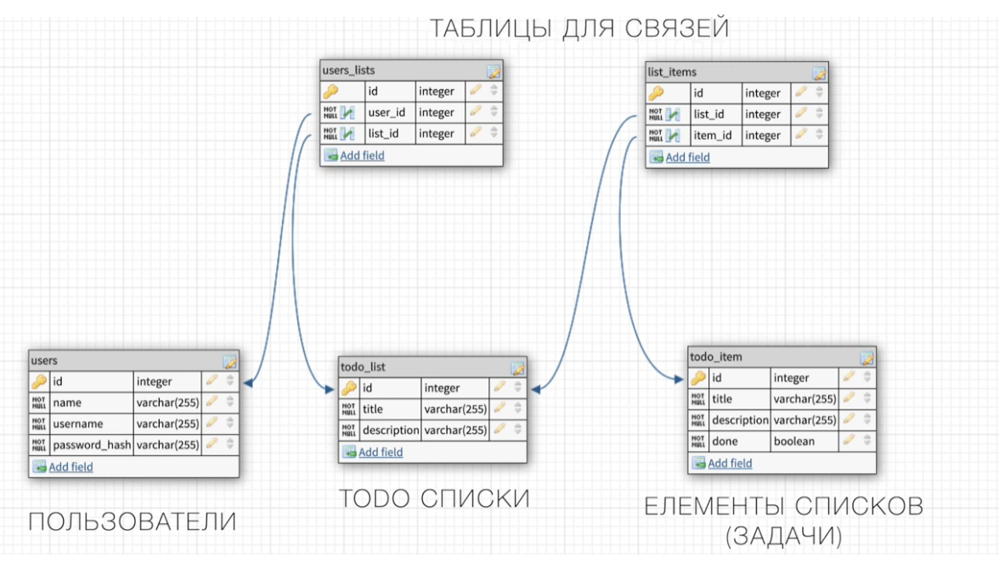

# service_todo

End-point

    POST            /AUTH/SIGN-UP
    POST            /AUTH/SIGN-IN

    GET             /LISTS
    GET             /LISTS/{ID}
    POST            /LISTS
    PUT             /LISTS/{ID}
    DELETE          /LISTS/{ID}
    GET             /LISTS/{ID}/ITEMS 
    POST            /LISTS/{ID}/ITEMS 

Таблицы баз данных

handler.go

Используется фреймворк **gin** для генерации маршрутов
Присвоение методов для каждого endpoints